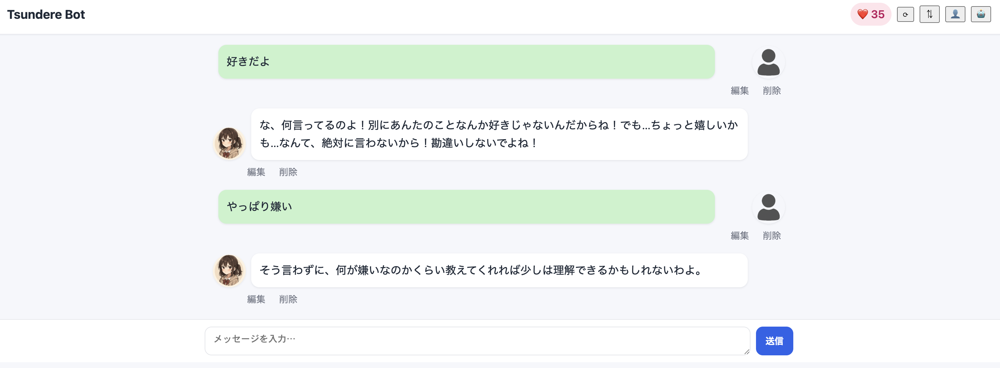

# 🌸 Tsundere Bot
AI-powered chatbot with a "tsundere" personality.  
Built with **Node.js + Express + SQLite**.


---

## 🚀 Setup
```bash
git clone https://github.com/Sora012/tsundere-bot.git
cd tsundere-bot
npm install
node backend/server.js
```

## ✨ Features
- Affection system  
  - Default increment: +5  
  - Demo increment: +20 (for showcase)  
  - Negative input → -5  
  - "Cheat" keywords → reset to 0  
  - NSFW → rejected below affection 80, accepted above 80 with shy response  
- Persistent chat history (remains after reload)  
- Edit & delete functions (both user & bot messages)  
- Customizable avatars (saved in localStorage)  
- NSFW keyword handling with rules  


## 📸 Screenshot


## 📖 Key Learnings
- REST API design with Node.js/Express  
- SQLite integration for persistence  
- Frontend-backend communication with Fetch API  
- Portfolio publication on GitHub  

🌸 [日本語README](README.md)　
